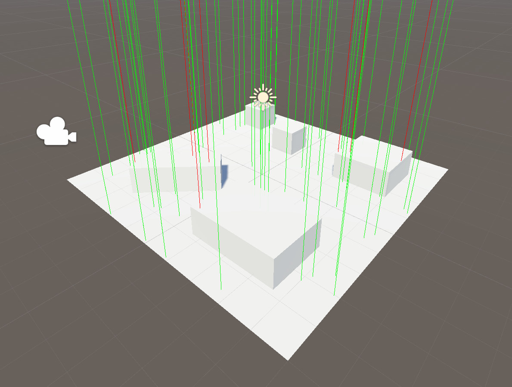

# RaycastWithinBounds

A simple example I wrote for someone on Unity forums how to raycast within bounds of an object like a ground plane or a terrain.

The idea in this example was to have an easy way of finding a valid spawn position for an item or something else.

In this test the ground object is detected by tag, which is coincidentally called "ground". Hits on anything else are discarded.

### shader in action (red lines are invalid hits)

